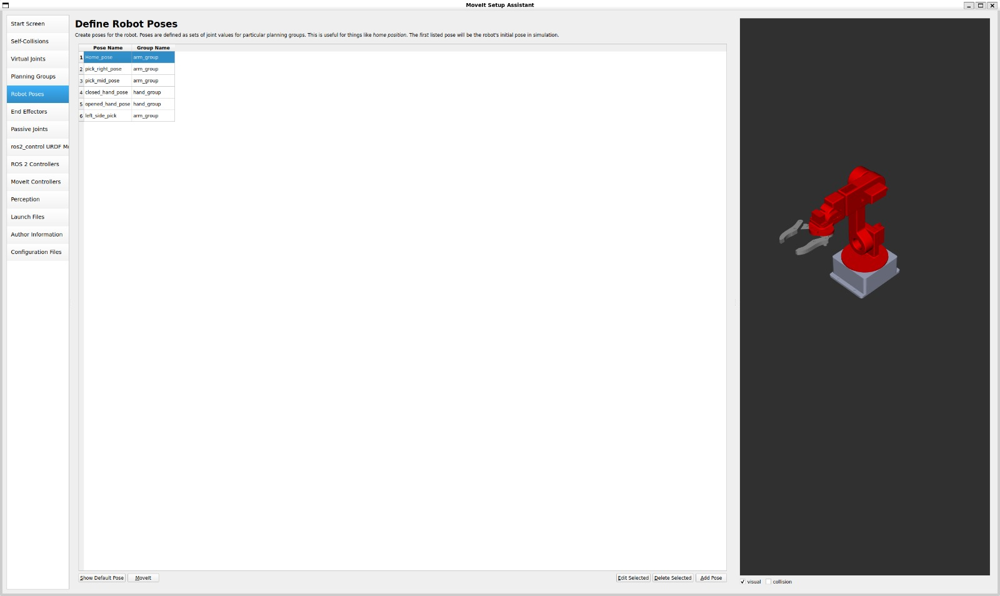
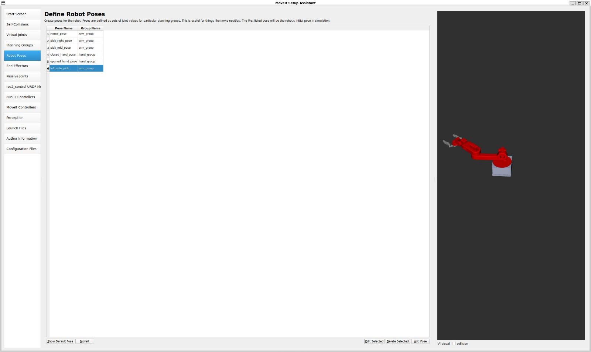
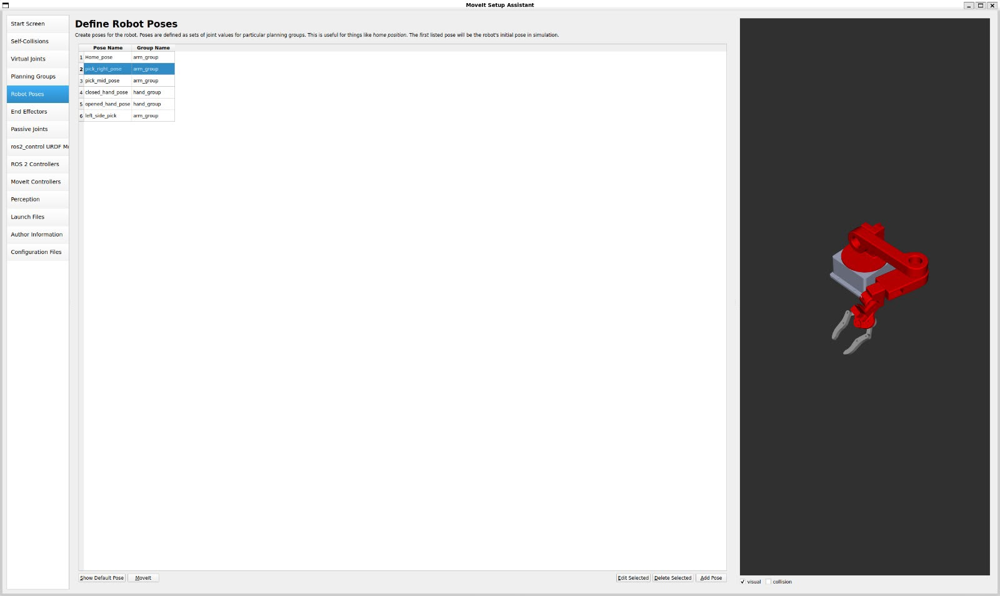
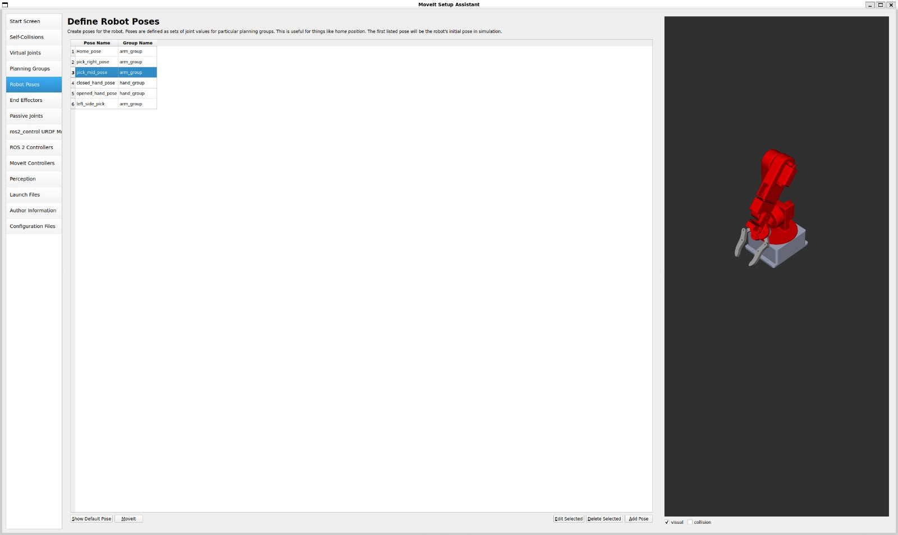
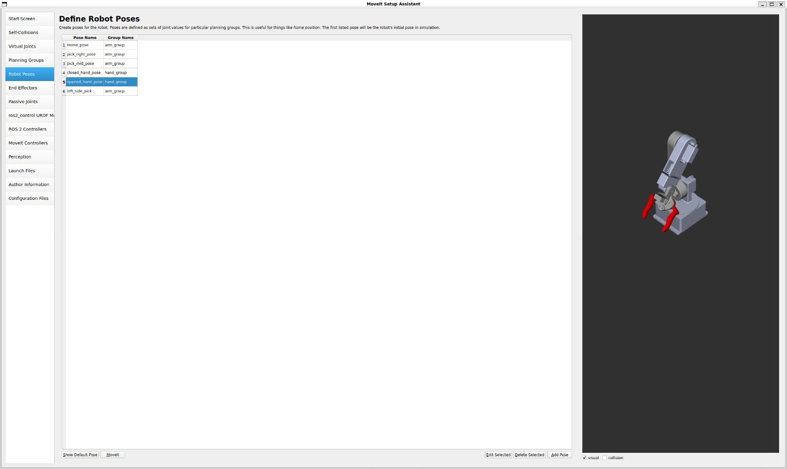
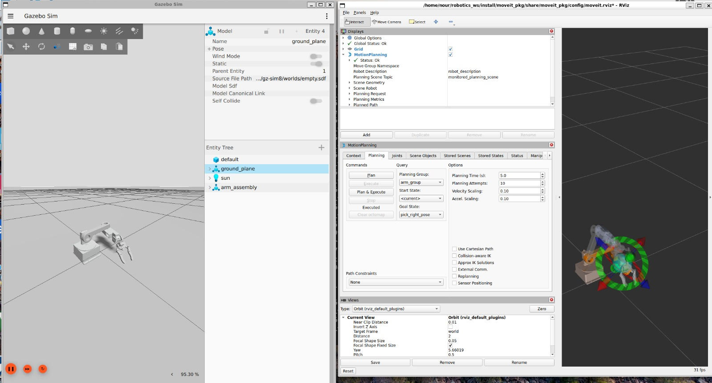
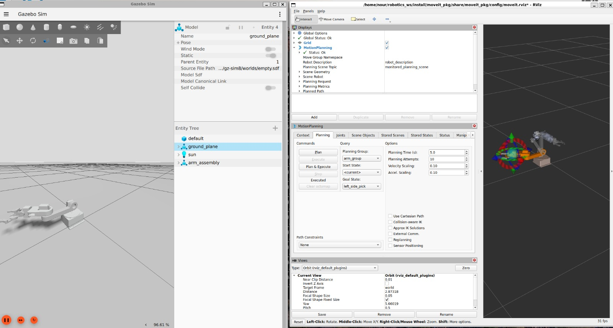
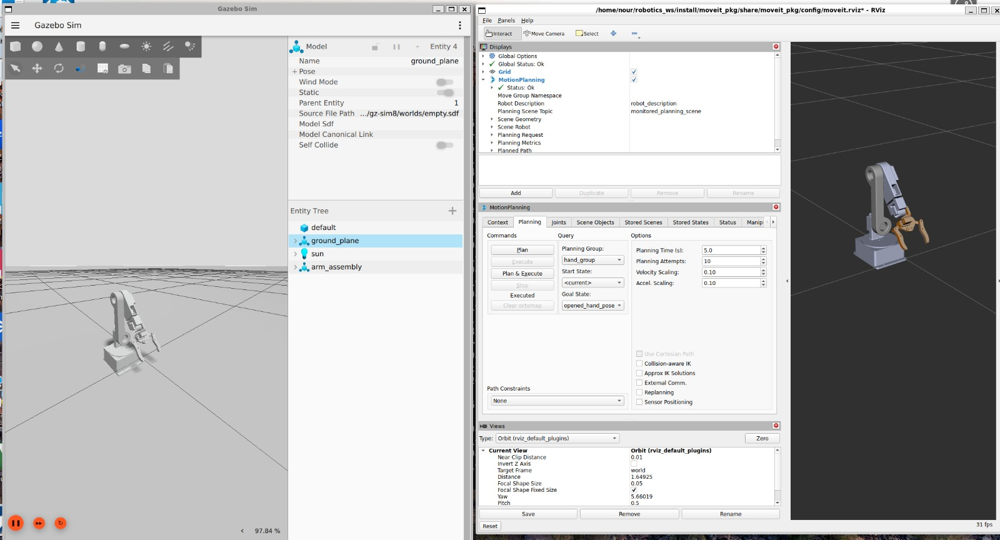
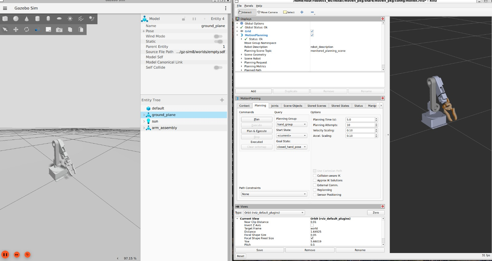
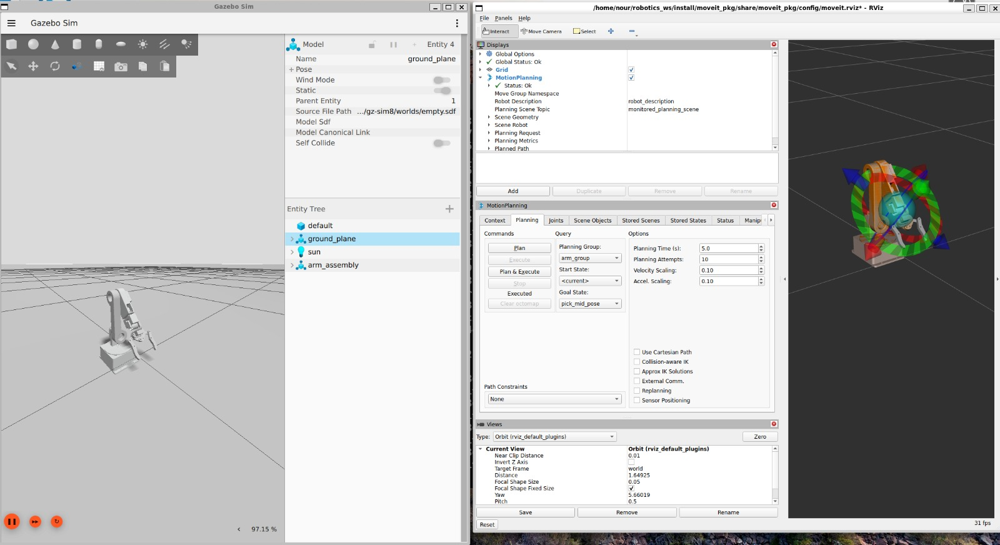

# 5-DOF Robotic Arm using ROS2 and MoveIt

## Overview

This project implements a 5-DOF robotic arm simulation and motion planning system using ROS2 and MoveIt.

The system includes robot modeling, URDF description, RViz visualization, MoveIt configuration, and Python-based motion control tools. The project demonstrates the complete workflow of building a robotic manipulation system, from robot description and visualization to trajectory planning and execution.

## Features

* 5-DOF robotic arm modeling
* ROS2-based robot description
* URDF robot model
* RViz visualization
* MoveIt motion planning
* Joint trajectory execution
* Python-based control using `pymoveit2`
* Modular ROS2 package structure

## Repository Structure

```text
Robotics_project/
├── src/
│   ├── robotics_project/     # Main robot description package
│   ├── moveit_pkg/           # MoveIt configuration package
│   └── pymoveit2/            # Python MoveIt2 control interface
└── .gitignore
```

## Main Packages

### `robotics_project`

Contains the robot model and visualization files, including:

* URDF files
* Meshes
* RViz configuration
* Launch files
* Robot configuration files

### `moveit_pkg`

Contains the MoveIt setup used for robotic arm motion planning and trajectory generation.

### `pymoveit2`

Provides Python-based control utilities for interacting with MoveIt2 and executing robotic arm movements.

## Technologies Used

* ROS2
* MoveIt2
* RViz
* URDF
* Python
* CMake
* Linux / Ubuntu

## Build Instructions

Clone the repository into a ROS2 workspace:

```bash
mkdir -p ~/robotics_ws/src
cd ~/robotics_ws/src
git clone https://github.com/Notsuperman7/Robotics_project.git
```

Build the workspace:

```bash
cd ~/robotics_ws
colcon build
source install/setup.bash
```

## Run the Project

Launch the robot visualization or MoveIt setup using the available launch files:

```bash
ros2 launch robotics_project <launch_file_name>.launch.py
```

or:

```bash
ros2 launch moveit_pkg <launch_file_name>.launch.py
```

> Replace `<launch_file_name>` with the actual launch file name inside the package.

## Project Goal

The goal of this project is to create a complete ROS2-based robotic arm environment that supports:

* Robot visualization
* Joint control
* Motion planning
* Trajectory execution
* Robotic manipulation simulation

## Demo

<details>
<summary>MoveIt Planning</summary>

<br>










</details>

<details>
<summary>Gazebo & Rviz </summary>

<br>








</details>

## Author

**Nour Eldin Mahmoud**

Mechatronics Engineering Student
Robotics • ROS2 • MoveIt • Robot Modeling • Motion Planning
